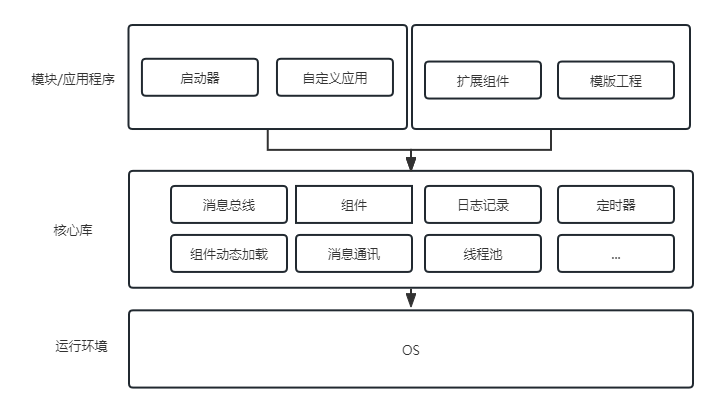

# myframe



## 概述
C++实现的actors框架,程序由actor和worker组成;  
actor基于消息驱动,actor之间可以进行消息传递;  
worker自驱动，可以通过消息与actor交互;  
不同actor和worker组合使用,可以提高代码复用,降低程序耦合度。

## 开发/运行环境
操作系统: Ubuntu 18.04+  
开发语言：[](https://img.shields.io/badge/language-cpp-green.svg)

## 安装依赖
```sh
sudo apt-get install build-essential cmake
sudo apt-get install libjsoncpp-dev libgflags-dev libgtest-dev libgoogle-glog-dev
# ubuntu18.04需要编译安装gtest
cd /usr/src/gtest
sudo cmake CMakeLists.txt 
sudo make 
sudo cp *.a /usr/lib
```

## 构建
```sh
mkdir build
cd build
cmake ..
sudo make install
```

## 运行
```sh
sudo bash /opt/myframe/bin/start_myframe.bash
```

## 创建模块工程
```sh
python3 /opt/myframe/tools/gen_mod_proj.py --dir="/path/to/proj_dir/" --name="mod_name"
```

### actor Hello,World Demo 示例
```c
#include <iostream>
#include <string.h>

#include "MyActor.h"
#include "MyMsg.h"

/*
    该actor实现：
        自己给自己发送一条消息
*/
class MyDemo : public MyActor
{
public:
    /* actor模块加载完毕后调用 */
    int Init(const char* param) override {
        /* 构造 hello,world 消息发送给自己 */
        return Send("demo.echo_hello_world", std::make_shared<MyTextMsg>("hello,world"));
    }

    void CB(std::shared_ptr<MyMsg>& msg) override {
        if (msg->GetMsgType() == "TEXT") {
            /* 获得文本消息， 打印 源actor地址 目的actor地址 消息内容*/
            auto tmsg = std::dynamic_pointer_cast<MyTextMsg>(msg);
            std::cout << "----> from \"" << tmsg->GetSrc() << "\" to \"" 
                << GetActorName() << "\": " << tmsg->GetData() << std::endl;
        }
    }
};

/* 创建actor模块实例函数 */
extern "C" std::shared_ptr<MyActor> my_actor_create(const std::string& Actor_name) {
    return std::make_shared<MyDemo>();
}

```

### actor配置文件
```json
{
    "type":"library",
    "lib":"libdemo.so",
    "actor":{
        "demo":[
            {
                "instance_name":"echo_hello_world",
                "instance_params":""
            }
        ]
    }
}
```
- type: [ library | class ]
- lib: 库名称
- actor: 需要创建的actor列表
    - demo: actor名
        - instance_name：实例名称
        - instance_params：实例参数

## 程序接口

- [Actor模块](https://github.com/lkpworkspace/myframe/blob/master/myframe/MyActor.h)
- [Worker模块](https://github.com/lkpworkspace/myframe/blob/master/myframe/MyWorker.h)
- [消息类型](https://github.com/lkpworkspace/myframe/blob/master/myframe/MyMsg.h)

## 文档
- [文档入口](https://github.com/lkpworkspace/myframe/wiki)

## 常见问题
- [FAQs](https://github.com/lkpworkspace/myframe/wiki/FAQs)
